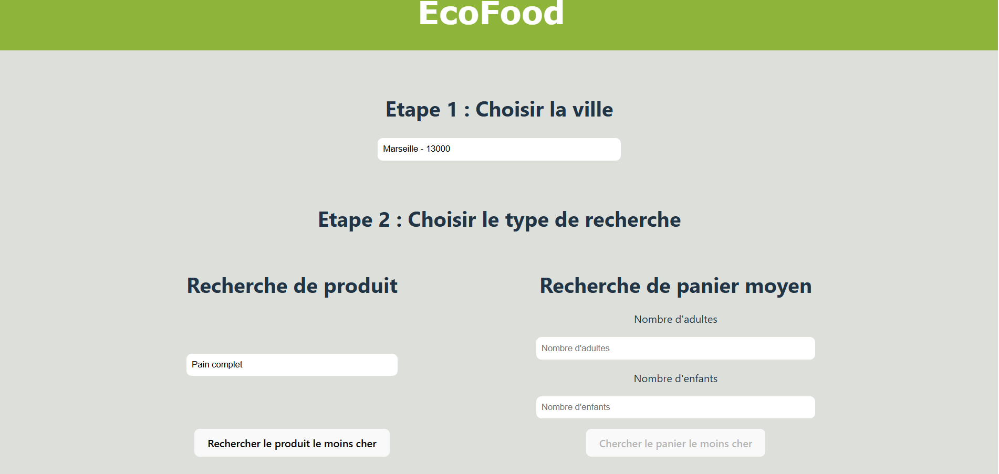
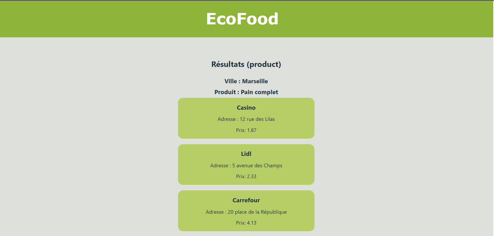
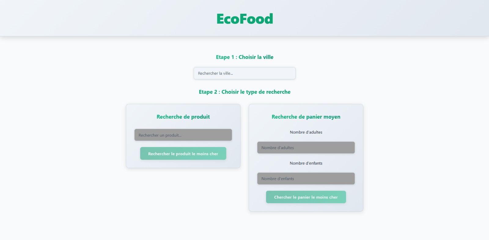
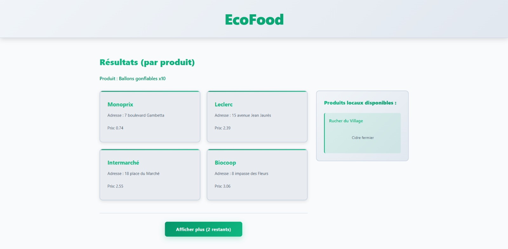

# EcoFood

EcoFood est un service de comparateur de prix de produits alimentaires qui permet à ses utilisateurs de trouver le meilleur prix et la meilleure qualité des produits qu'ils achètent autour de chez lui.

## Choix du sujet

En tant qu'étudiants, les questions d'insécurités alimentaires nous touchent directement. En effet, 43% des étudiants sont en situation de précarité alimentaire ([source : Yakasaider](https://www.yakasaider.fr/article/wp-content/uploads/2023/12/CMV329.pdf)).

EcoFood est né de ce constat : permettre aux personnes ayant un budget restreint (étudiants, familles monoparentales, travailleurs précaires, etc.) de mieux se nourrir en trouvant des produits de qualité à des prix plus bas.

## Utilité Sociale

L’alimentation est un besoin fondamental, mais de plus en plus de ménages peinent à y accéder correctement. EcoFood vise à répondre à cette problématique en plusieurs axes d'action :

- **Amélioration de la qualité de vie** : en aidant les utilisateurs à accéder à une alimentation plus saine sans dépasser leur budget. Cela permet d'améliorer le pouvoir d'achat des utilisateurs qui pourront l'utiliser dans d'autres domaines.
- **Valorisation des commerces locaux** : EcoFood met en avant des magasins de proximité et producteurs locaux souvent invisibilisés face aux grandes surfaces. Cela permet de dynamiser l'économie local.
- **Réduction des inégalités** : en donnant à chacun les moyens de mieux comparer et choisir, l’app contribue à rendre l’alimentation saine plus équitablement accessible.

## Effets de la numérisation

Comme tout service numérique, EcoFood comporte des effets positifs mais aussi certains risques qu’il convient d’identifier et de limiter.

### Substitution aux prospectus papier

L’application cherche à se substituer aux traditionnels prospectus publicitaires distribués par les grandes enseignes.  
Chaque foyer reçoit environ **30 kg de prospectus par an**, ce qui nécessite la coupe d’environ **21 millions d’arbres** pour produire le papier correspondant ([source : Notre-planète.info](https://www.notre-planete.info/actualites/2573-prospectus-papier-publicite?utm_source=chatgpt.com)).

Le passage au numérique constitue donc une alternative plus respectueuse de l’environnement. Par exemple :

- **Prospectus digital** : ~0,72 g équivalent CO₂ par page lue
- **Prospectus papier** : ~10,22 g équivalent CO₂ par feuille

([source : Bonial](https://www.bonial.fr/info/empreinte-carbone-prospectus/?utm_source=chatgpt.com))

### Impact indirect et comportements des usagers

EcoFood peut également avoir un impact indirect sur les pratiques de consommation :

- **Effet positif** : réduire les déplacements inutiles en regroupant les courses, mettre en avant des commerces de proximité et encourager l’achat de produits locaux.
- **Risque d’effet rebond** : si l’utilisateur est incité à multiplier les trajets pour chercher la meilleure promotion, les gains écologiques du numérique peuvent être annulés.

## Scénarios d'usage et impact

Nous faisons l'hypothèse que le site n'est pas utilisé régulièrement par le même utilisateur, mais qu'il constitue plutôt un outil ponctuel pour choisir l'endroit où consommer lorsque l'utilisateur ne connaît pas les différentes options autour de lui.  
Un même utilisateur ne reviendra donc pas souvent sur le site pour réaliser la même analyse des prix.

### Scénario 1 : Comparer un article entre différents magasins

1. L’utilisateur se rend sur l’onglet **« comparer produit »**.
2. Il choisit une **ville** où regarder les informations.
3. Il utilise le **menu déroulant** pour voir tous les types de produits.
4. Il sélectionne un **type de produit**.
5. Il visualise les **différents prix** pour ce produit dans les différents établissements.

### Scénario 2 : Comparer un ensemble de produits entre différents magasins

1. L’utilisateur se rend sur l’onglet **« comparer panier »**.
2. Il choisit une **ville** où regarder les informations.
3. Il sélectionne son **profil** parmi une liste déroulante (ex. : _Famille de 4, Célibataire…_).
4. Il a ensuite accès aux **prix moyens** d’un panier correspondant à ce profil dans chaque établissement.

### Impact de l'exécution des scénarios auprès de différents services concurrents

Il existe un moyen d'estimer l'impact numérique d'un site web : [l’EcoIndex](https://www.ecoindex.fr/).  
Cet indicateur calcule un score (de **A à G**) en fonction de plusieurs facteurs, tels que :

- Le nombre d'appels au serveur (requêtes)
- La quantité d'information téléchargée
- La complexité et l'optimisation du site

Nous avons réalisé une analyse des sites concurrents, et voici les résultats :

| Service                                                     | Score (sur 100) | Classe | Détail des mesures                                                       |
| ----------------------------------------------------------- | --------------- | ------ | ------------------------------------------------------------------------ |
| [UFC Que Choisir](https://www.quechoisir.org/)              | 22              | F 🟪   | [...](./benchmark/UFC_QueChoisir/ecoindex-environmental-statement.md)    |
| [Qui-est-le-moins-cher](https://www.quiestlemoinscher.com/) | 79              | B 🟩   | [...](./benchmark/QuiEstLeMoinsCher/ecoindex-environmental-statement.md) |

**Tab.1** : Mesure de l'EcoIndex moyen de divers services de comparateur de prix.

Les rapports EcoIndex mettent en évidence plusieurs points problématiques : pages très volumineuses et nombreux appels réseau, DOM très lourd, images et médias pas ou peu optimisés, présence de gros bundles JavaScript et scripts tiers non essentiels, et absence de stratégies de cache efficaces. Ces facteurs augmentent la consommation d'énergie, la consommation d'eau virtuelle et les émissions de GES lors du chargement des pages.

## Modèle économique

### Analyse des modèles existants

Dans un premier temps, nous avons étudié plusieurs services similaires afin de comprendre leurs modèles économiques et d’identifier les leviers possibles pour **EcoFood**.

| **Service**                           | **Moyen de financement**                              |
| ------------------------------------- | ----------------------------------------------------- |
| **UFC - Que choisir**                 | Dons, financements publics, abonnements aux magazines |
| **Leclerc - Qui est le moins cher ?** | Produit d’appel (outil marketing interne)             |
| **Anti-crise**                        | Publicité, abonnements aux magazines                  |

**Sources :**

- [Financement UFC - Que Choisir](https://www.consolidons.org/pourquoi/#:~:text=L'ind%C3%A9pendance%20financi%C3%A8re%20de%20l,int%C3%A9r%C3%AAt%20g%C3%A9n%C3%A9ral%20de%20l'association.)
- [Financement Anti-crise](https://media.anti-crise.fr/2018/09/Plaquette-Anti-Crise-2.pdf)

L’analyse de ces services met en évidence un **oligopole de produits homogènes**.  
En d’autres termes :

- Il existe peu de comparateurs de prix réellement actifs sur le marché.
- Les services proposés sont très similaires, souvent centrés sur les grandes enseignes.
- Ces services sont donc **hautement substituables** les uns aux autres.

Pour se distinguer, **EcoFood** mise sur la **mise en avant des producteurs locaux et des commerces de proximité**, ce qui apporte une **valeur ajoutée territoriale et écologique**.

---

### Construction d’un modèle économique viable

Afin de définir un modèle de financement durable et réaliste, nous avons étudié plusieurs hypothèses et leurs impacts financiers :

| **Source de revenus potentielle**              | **Montant unitaire estimé** | **Quantité nécessaire pour financer un salaire mensuel** |
| ---------------------------------------------- | --------------------------- | -------------------------------------------------------- |
| Mise en avant des offres de producteurs locaux | 50 €                        | 72                                                       |
| Financement public                             | 5 000 €                     | 0,72                                                     |
| Dons individuels                               | 5 € – 100 €                 | 714 – 36                                                 |
| Affichage publicitaire (régie tierce)          | 0,00046 € / vue             | 7 758 696 vues                                           |

---

### Analyse des résultats

- **Publicité en ligne** : modèle non viable car cela nécessiterait un trafic massif et irait à l’encontre de notre **démarche écoresponsable**.
- **Dons** : possible en complément, mais difficilement suffisant pour assurer la stabilité financière du service car elle dépend des donateurs.
- **Mise en avant de producteurs locaux** : concept intéressant mais limité car atteindre 72 producteurs reste peu réaliste dans un premier temps.
- **Financement public** : apparaît comme la solution la plus **cohérente et durable**, notamment via des dispositifs tels que :
  - [Financement – Numérique écoresponsable](https://ecoresponsable.numerique.gouv.fr/financement/)
  - [Projets d’Avenir Innovation – Grand Est](https://innovationavenir.grandest.fr/projets-davenir-innovation/)

---

### Positionnement final

Pour rester fidèle à notre démarche **écologique et d’intérêt général**, **EcoFood** sera majoritairement financé par des **aides publiques** et des **subventions territoriales**.  
Les **dons** et la **mise en avant de producteurs locaux** viendront en complément, dans une logique participative, sans compromettre la neutralité et la sobriété du service.

## Maquette de l'interface et échantillon de données.

Au vu des différents services comparés, des exigences environnementales exprimées plus haut et des scénarios retenus, nous avons défini pour notre prototype une maquette de l'interface et un échantillon de données réalistes.

Les ressources Web possédant une représentation sur notre application seront de deux types :

- le comparateur de prix par type de produit autour d'une ville identifiée (avec une HTTP-URI ayant pour chemin /{ville}/{idProduit})
- comparateur d'un panier moyen selon le nombre de personnes, autour d'une ville (avec une HTTP-URI ayant pour chemin /{ville}/panier_moyen?nombre_adultes={nbr_A}&nombre_enfants={nbr_e})

**Fig.1**: Maquette de l'interface du prototype : a. type de page pour la comparateur ( par produit ou par panier), b. type de page des résultats.

Pour des raisons d'infrastructure' , nous utilisons des données générées (avec dummy-json). Bien que fictives, ces données correspondent à la structure des services concurrents : les informations des produits et des enseignes sont présentes ([voir modèle de données](./frontend/sample_data.hbs)).

## Implémentation du scénario prioritaire

### Etape de prototypage : Données chargées de manière statique

Pour cette première version du prototype (v1.0.0) :

- l'échantillon de données est encore chargé dans le code de manière statique,
- les fonctionnalités implémentées ne sont que celles nécessaires pour suivre le scénario prioritaire ("Comparer un article entre différents magasins").

Ce scénario nécessite de pouvoir naviguer entre deux types de page : la page d'accueil et la page où les résultats sont affichés.

### Page d'accueil

Nous avons développé la page d'accueil (cf. Fig. 2) pour qu'elle affiche les différentes options de sélections.

**Fig.2**: Prototype de la page d'accueil.

Nous avons privilégié l'utilisation du CSS natif afin d'optimiser les performances et de limiter la consommation énergétique de l'application, en cohérence avec nos objectifs d'éco-conception.

Par ailleurs, nous avons volontairement exclu l'intégration d'une carte interactive pour le choix du lieu. L'utilisation d'une liste déroulante offre une expérience plus rapide et consomme significativement moins de ressources lors du chargement, ce qui contribue à réduire l'empreinte environnementale. Cette décision s'appuie sur l'exemple de quiestlemoinscher.fr, qui privilégie la simplicité et l'efficacité tout en respectant les principes d'éco-conception.

À ce stade du prototype, il est possible d'obtenir une première estimation de l'impact environnemental du frontend. Même si le chargement dynamique des données n'est pas encore en place, l'affichage des données permet déjà une évaluation pertinente. Les résultats (cf. Tab.1) sont encourageants en mode "développement" et encore meilleurs en mode "pré-production", grâce notamment à l'utilisation d'outils de développement Web qui assurent la minification et la concaténation du code et des feuilles de style.

| Page                  | Grade | Ecoindex | Eau (cl) | GES (gCO2e) | Nb de requêtes | Taille de la page (Ko) | Taille du DOM |
| --------------------- | ----- | -------- | -------- | ----------- | -------------- | ---------------------- | ------------- |
| Mode "développement"  | A 🟦  | 84/100   | 19.80    | 1.32        | 22             | 1929.177               | 27            |
| Mode "pré-production" | A 🟦  | 95/100   | 16.40    | 1.09        | 3              | 86.506                 | 26            |

**Tab.4**: Évaluation de l'impact du prototype de la page d'accueil.

### Page des résultats

Les pages des articles ont pour HTTP-URI /results/{id_ville}/{id_produit}.

De même que précédemment, nous avons tenté d'implémenter cette page (cf. Fig. 3) conformément à ce que prévoyait la maquette. Notons que nous n'avons pas inclu la deuxième liste de résultats pour les producteurs locaux qui fera l'objet d'une prochaine amélioration.

**Fig.3**: Prototype de la page de résultats.

Avec l'ajout de ce modèle de page et la mise en place de la navigation entre les deux modèles, il devient possible d'exécuter le scénario prioritaire complet et de mesurer son impact.

| Page                                           | Grade | Ecoindex | Eau (cl) | GES (gCO2e) | Nb de requêtes | Taille de la page (Ko) | Taille du DOM |
| ---------------------------------------------- | ----- | -------- | -------- | ----------- | -------------- | ---------------------- | ------------- |
| 1. Choisir la ville et le produit              | A 🟦  | 95/100   | 16.40    | 1.09        | 3              | 86.506                 | 26            |
| 2. Consulter les résultats                     | A 🟦  | 96/100   | 16.20    | 1.08        | 3              | 1.076                  | 29            |
| 3. Revenir à la page d'accueil                 | A 🟦  | 96/100   | 16.10    | 1.08        | 3              | 1.076                  | 26            |
| 4. Choisir une autre ville et un autre produit | A 🟦  | 96/100   | 16.20    | 1.08        | 3              | 1.076                  | 29            |

**Tab.5**: Évaluation de l'impact du scénario "Comparer un article entre différents magasins" dans le prototype n°1.

Bien que ces estimations soient volontairement optimistes en raison du chargement statique des données, elles restent pertinentes pour une comparaison avec les services concurrents évoqués plus haut.

Si nous parvenons à maintenir les émissions en dessous de 1,1 g de CO₂ par page pour notre produit minimum viable, nous serons en mesure d'offrir une solution environ 15 % moins impactante que les alternatives existantes, tout en prenant en compte l'ensemble du cycle de vie du terminal utilisé.

### Étape de prototypage : Données statiques chargées de manière dynamique

Dans cette nouvelle version du prototype (v1.0.1), le fonctionnement reste inchangé, mais les données statiques sont désormais récupérées par le frontend via une requête réseau juste après l'affichage initial de la page. Cette approche, plus proche d'un usage réel, entraîne simplement une requête supplémentaire par page affichée.

En ce qui concerne l'impact environnemental du scénario, les résultats restent strictement identiques à ceux du tableau précédent (cf. Tab.2), à l'exception du nombre de requêtes qui augmente de 1, ainsi que la taille de la page qui diminue d'environ 10%.

## Mesures de la consommation énergétique lors du passage à l'échelle

Maintenant que notre prototype est réaliste en termes de nombre de requêtes, nous pouvons évaluer les effets du "passage à l'échelle" en augmentant significativement les données.

Pour le secteur de la grande distribution, l'augmentation du volume de données provient principalement de l'expansion du nombre de magasins, du nombre d'articles proposés et de la couverture géographique. Le nombre de villes change rarement dans cette logique de scaling.

Nous avons multiplié le volume de données par **environ 25x** en effectuant les modifications suivantes :

### Augmentation des données

| Dimension                | Avant  | Après   | Multiplication |
| ------------------------ | ------ | ------- | -------------- |
| **Magasins**             | 80-100 | 400-500 | ×5             |
| **Enseignes**            | 4      | 12      | ×3             |
| **Produits par magasin** | 20-30  | 300-400 | ×15            |
| **Villes**               | 6      | 70      | ×12            |
| **Produits uniques**     | 20     | 500     | ×25            |

### Détails des changements

**Magasins et enseignes** :

- Ajout de 12 enseignes (Carrefour, Leclerc, Monoprix, Super U, Franprix, Biocoop, Grand Frais, Aldi, Lidl, Intermarché, Casino, Géant Casino)
- Multiplication des points de vente avec ~10 adresses variées par enseigne
- Gamme de prix étendue : 0.55€ à 15.99€ (au lieu de 0.55€ à 4.8€)

**Couverture géographique** :

- 70 villes françaises représentant la couverture nationale
- Codes postaux cohérents et réalistes
- Inclusion de grandes et moyennes villes

**Produits** :

- 500 produits uniques répartis en catégories variées (épicerie, frais, surgelés, boissons, hygiène, bébé, maison, électronique)
- Noms détaillés et réalistes
- 100-200 produits disponibles par magasin

### Évolution de l'EcoIndex lors du passage à l'échelle

Produites désormais de manière automatique lors de l'intégration continue, les mesures nécessaires à la production de l'EcoIndex, avant et après la simulation du passage à l'échelle, démontrent l'impact significatif de l'augmentation du volume de données.

|                                |                       EcoIndex |               GES (gCO2e) |        Taille du DOM | Requêtes |    Taille de la page (ko) |
| ------------------------------ | -----------------------------: | ------------------------: | -------------------: | -------: | ------------------------: |
| 1.Choisir une ville            | <del>89 A 🟦</del> 75 B 🟩 |   <del>1,22</del> 1,5 |                   35 |        5 | <del>277</del> 11 142 |
| 2. Choisir un produit          | <del>87 A 🟦</del> 55 C 🟨 |   <del>1,26</del> 1,9 | <del>56</del> 536 |        5 | <del>277</del> 11 142 |
| 3. Regarder les produits       | <del>93 A 🟦</del> 94 A 🟦 | <del>1,14</del>  1,12 | <del>46</del> 18 |        0 |                         0 |
| 4. Revenir à la page d'accueil | <del>89 A 🟦</del> 75 B 🟩 |   <del>1,22</del> 1,5 |                   35 |        4 | <del>275</del> 11 140 |

**Tab.6**: Effet du passage à l'échelle sur l'impact du scénario "Trouver le prix le moins cher pour un produit" dans le prototype v1.0.1.

Le passage à l'échelle provoque une dégradation progressive de l'impact environnemental. La page de sélection de ville voit son EcoIndex passer de 89 A 🟦 à 75 B 🟩 (poids : 277 Ko → 11 142 Ko). La page de sélection de produit se dégrade davantage (87 A 🟦 → 55 C 🟨) avec une explosion du DOM (56 → 536 éléments) et augmentation du GES (1,26 → 1,9 gCO2e). La page de consultation des résultats s'améliore légèrement (93 A 🟦 → 94 A 🟦) car elle ne charge que les données du produit sélectionné. Une optimisation future (pagination, lazy loading) sera nécessaire pour maintenir un impact acceptable au-delà de 500 produits.

### Mesure de la consommation énergétique liée à la consultation

Pour mesurer la consommation de notre service numérique, nous avons choisi d'utiliser le logiciel **GreenFrame**.
Ce logiciel est capatable d'estimer la consommation énergétique des différents composants d'une architecture :

- CPU (à partir du temps de calcul)
- Mémoire vive RAM (à partir de la taille des données mise en mémoire)
- Stockage (à partir de la taille des données lues et écrites)
- Réseau (à partir de la taille des données envoyées et reçues)
- Ecran (à partir du temps d'exécution fixé par nos scénarios)

| (a)         | CPU (Wh) | RAM (Wh) | Stockage (Wh) | Réseau (Wh)        | Ecran (Wh)         | Total (Wh) |
| ----------- | -------- | -------- | ------------- | ------------------ | ------------------ | ---------- |
| Navigateur  | 0.0030   | 0.000016 | 0.0           | <mark>0.066</mark> | <mark>0.069</mark> | 0.14       |
| Serveur Web | 0.000061 | 0.000020 | 0.0           | <mark>0.063</mark> | 0.0                | 0.063      |

| (b)         | CPU (Wh) | RAM (Wh) | Stockage (Wh) | Réseau (Wh)        | Ecran (Wh)         | Total (Wh) |
| ----------- | -------- | -------- | ------------- | ------------------ | ------------------ | ---------- |
| Navigateur  | 0.00031  | 0.00013  | 0.0           | 0.0014             | <mark>0.067</mark> | 0.069      |
| Serveur Web | 0.000074 | 0.000021 | 0.0           | <mark>0.063</mark> | 0.0                | 0.064      |

**Tab.7**: Estimation de la consommation énergétique de la recherche d'un utilisateur (premier tableau) et de la consultation des résultats (second tableau).

Par rapport à ce que pouvait laisser penser l'EcoIndex, les résultats (cf. Tab.7) indiquent que la consommation due à la consultation de l'index est équivalente à celle des résultats. Autrement dit, l'affichage en lui même de ces données en grand nombre est négligeable par rapport à la transmission de ces données sur le réseau.

On peut ainsi voir que les consommations les plus importantes viennent de ces deux éléments :

- le réseau du client,
- le réseau du serveur.

### Effet de l'introduction d'une base de données

Afin de réduire l'impact énérgétique du réseau, nous stockons désormais les données de l'application (`v2.0.0`) dans une base de données (*CouchDB*).
Cette évolution nous permet de récupérer sur l'index et dans la page de résultat seulement les données nécessaires à l'affichage.

| Service | cpu (Wh) | mem (Wh) | disk (Wh) | network (Wh) | screen (Wh) | total (Wh) |
| --- | --- | --- | --- | --- | --- | --- |
| Navigateur | 0.00083 | 0.000045 | 0.0 | 0.0013 | 0.067 | 0.070 |
| Serveur Web | 0.0000031 | 0.0000028 | 0.0 | 0.0013 | 0.0 | 0.0013 |
| Base de données | 0.00071 | 0.000071 | 0.0 | 0.0000089 | 0.0 | 0.00079 |

__Tab.8__: Mesure de la consommation énergétique des services Docker lors de l'exécution.

Cette amélioration (cf. Tab.8) est assez spectaculaire avec notamment (pour les valeurs significatives) :

- une réduction de 98% de la quantité de données chargées par le client (réseau client : 0.066 → 0.0013 Wh),
- une réduction de 72% de la charge du CPU sur le client (CPU client : 0.0030 → 0.00083 Wh),
- une réduction de 98% du réseau du serveur Web (réseau serveur : 0.063 → 0.0013 Wh),
- une utilisation des ressources par la base de données négligeable excepté une consommation mesurable en CPU (0.00071 Wh) et réseau (0.0000089 Wh).

#### Scénario 1 : Chercher un produit ou un panier moyen selon la ville de l'utilisateur

| Service | cpu (Wh) | mem (Wh) | disk (Wh) | network (Wh) | screen (Wh) | total (Wh) |
| --- | --- | --- | --- | --- | --- | --- |
| Navigateur | 0.00088 | 0.000045 | 0.0 | 0.0013 | 0.067 | 0.070 |
| Serveur Web | 0.0000036 | 0.0000028 | 0.0 | 0.0013 | 0.0 | 0.0013 |
| Base de données | 0.00084 | 0.000072 | 0.0 | 0.0000075 | 0.0 | 0.00092 |

__Tab.8a__: Estimation de la consommation énergétique lors de la recherche d'un produit ou d'un panier moyen.

L'empreinte écologique estimée est de **31.772 mg eq. CO₂ ± 0.7% (71.883 mWh)**.

#### Scénario 2 : Voir les résultats de la recherche

| Service | cpu (Wh) | mem (Wh) | disk (Wh) | network (Wh) | screen (Wh) | total (Wh) |
| --- | --- | --- | --- | --- | --- | --- |
| Navigateur | 0.00070 | 0.000042 | 0.0 | 0.0013 | 0.068 | 0.070 |
| Serveur Web | 0.0000029 | 0.0000028 | 0.0 | 0.0013 | 0.0 | 0.0013 |
| Base de données | 0.00077 | 0.000071 | 0.0 | 1.3e-7 | 0.0 | 0.00084 |

__Tab.8b__: Estimation de la consommation énergétique lors de la consultation des résultats de la recherche.

Pour la consultation des résultats de la recherche, cette forte diminution de l'utilisation des ressources se traduit par une consommation énergétique estimée (cf. Tab.8b) quasiment minimale puisqu'à peine supérieure à celle de l'écran (0.068 Wh contre 0.070 Wh pour navigateur).

Concernant la recherche d'un produit (cf. Tab.8a), par contre, l'ajout de la base de données a eu pour seul effet notable de maintenir une consommation équilibrée entre les différents services. La consommation du réseau reste stable (0.0013 Wh pour le client et le serveur Web), et la base de données consomme très peu (0.0000075 Wh). Pour réduire davantage cette consommation, nous pourrions explorer des stratégies de mise en cache côté client ou de pagination progressive des résultats.

### Stratégie de limitation de la taille des éléments récupérés

Afin de réduire la taille de nos appels réseau, nous avons implémenté une stratégie d'optimisation des requêtes. Lors de la récupération des données sur la page d'accueil, nous chargeons uniquement les champs nécessaires pour l'affichage (les noms des villes et produits), ce qui réduit significativement la taille de nos requêtes. De plus, au lieu de transmettre toutes les informations au composant, chaque composant effectue son propre appel aux données pour récupérer uniquement ce dont il a besoin. Cette approche augmente légèrement le nombre de requêtes, mais les rend beaucoup plus légères, résultant en une consommation énergétique globalement inférieure. 

#### Scénario 1 : Chercher un produit ou un panier moyen selon la ville de l'utilisateur (optimisé)

| Service | cpu (Wh) | mem (Wh) | disk (Wh) | network (Wh) | screen (Wh) | total (Wh) |
| --- | --- | --- | --- | --- | --- | --- |
| Navigateur | 0.00083 | 0.000045 | 0.0 | 0.0013 | 0.067 | 0.070 |
| Serveur Web | 0.0000031 | 0.0000028 | 0.0 | 0.0013 | 0.0 | 0.0013 |
| Base de données | 0.00071 | 0.000071 | 0.0 | 0.0000089 | 0.0 | 0.00079 |

__Tab.9a__: Estimation de la consommation énergétique après optimisations - recherche d'un produit ou d'un panier moyen.

#### Scénario 2 : Voir les résultats de la recherche (optimisé)

| Service | cpu (Wh) | mem (Wh) | disk (Wh) | network (Wh) | screen (Wh) | total (Wh) |
| --- | --- | --- | --- | --- | --- | --- |
| Navigateur | 0.00081 | 0.000044 | 0.0 | 0.0014 | 0.067 | 0.070 |
| Serveur Web | 0.0000031 | 0.0000028 | 0.0 | 0.0013 | 0.0 | 0.0013 |
| Base de données | 0.00075 | 0.000070 | 0.0 | 0.000025 | 0.0 | 0.00085 |

__Tab.9b__: Estimation de la consommation énergétique après optimisations - consultation des résultats.

Le peu de variation observé entre les deux étapes est dû à la taille relativement petite du jeu de données utilisé pour les tests, comparée à un jeu de données réelles. Ces optimisations de requêtes révèlent toute leur efficacité avec des bases de données plus volumineuses, où les gains de performance énergétique deviendraient plus significatifs.

## Améliorations du projet

Nous avons réalisé 2 améliorations distinctes afin de rendre ce projet plus complet. La première amélioration est l'amélioration de l'affichage. 

### Affichage

Nous avons remis au goût du jour le style du site web à travers l'amélioration du CSS. Cette amélioration n'augmente pas la consommation du site web et permet seulement un style plus épuré et professionnel. En ce qui concerne l'affichage, nous avons également ajouté un bouton « Afficher plus » dans le cas où l'utilisateur souhaite accéder à plus de résultats. Dans l'objectif de trouver les magasins avec les produits les moins chers, il semble peu probable que l'utilisateur ait besoin de plus de résultats que les 4 premiers magasins. Cependant, nous pouvons afficher plus de résultats si nécessaire.

**Fig.4**: Page d'accueil avec le nouveau style.

**Fig.5**: Page de résultats avec le nouveau style.

### Ajout des producteurs locaux 

Dans la démarche de mettre en avant les producteurs locaux nous avons décidé de les introduire dans notre projet sur la page résultat. Puisque les producteurs locaux ne peuvent pas rivaliser en termes d'offre, nous avons décidé de mettre en avant tous les producteurs locaux dans la ville que l'on cherche même si ils ne possèdent pas l'objet de recherche de l'utilisateur. De cette façon, les utilisateurs pourront découvrir les producteurs locaux de leurs villes, peu importe leurs besoins (cf. Fig. 5). Cet ajout demande plus de ressources car cela ajoute une requête lors de la récupération des résultats. 

#### Scénario 1 : Chercher un produit ou un panier moyen selon la ville de l'utilisateur 

| Service  | cpu (Wh)    | mem (Wh)    | disk (Wh) | network (Wh) | screen (Wh) | total (Wh) |
| --- | --- | --- | --- | --- | --- | --- |
| Navigateur | <del>0.00083</del> 0.0014 | <del>0.000045</del> 0.000050 | 0.0 | <del>0.0013</del> 0.0014 | <del>0.067</del> 0.068 | <del>0.070</del> 0.071 |
| Serveur Web | <del>0.0000031</del> 0.0000030 | <del>0.0000028</del> 0.0000029 | 0.0 | <del>0.0013</del> 0.0014 | 0.0 | <del>0.0013</del> 0.0014 |
| Base de données | <del>0.00071</del> 0.00072 | <del>0.000071</del> 0.000066 | 0.0 | 0.0000089 | 0.0 | 0.00079 |

__Tab.10a__: Estimation de la consommation énergétique après ajout des producteurs locaux - recherche d'un produit ou d'un panier moyen.

#### Scénario 2 : Voir les résultats de la recherche (optimisé)

| Service | cpu (Wh) | mem (Wh) | disk (Wh) | network (Wh) | screen (Wh) | total (Wh) |
| --- | --- | --- | --- | --- | --- | --- |
| Navigateur | <del>0.00081</del> 0.00094 | <del>0.000044</del> 0.000046 | 0.0 | 0.0014 | <del>0.067</del> 0.068 | 0.070 |
| Serveur Web | <del>0.0000031</del> 0.0000028 | <del>0.0000028</del> 0.0000029 | 0.0 | 0.0014 | 0.0 | <del>0.0013</del> 0.0014 |
| Base de données | <del>0.00075</del> 0.00071 | <del>0.000070</del> 0.000066 | 0.0 | <del>0.000025</del> 0.000032 | 0.0 | <del>0.00085</del> 0.00081 |

__Tab.10b__: Estimation de la consommation énergétique après ajout des producteurs locaux - consultation des résultats.

**Comparaison entre les optimisations (Tab.9) et l'ajout de style + producteurs locaux (Tab.10)** :

Entre les tableaux 9 et 10, deux améliorations ont été apportées : l'ajout du style CSS et l'intégration des producteurs locaux (qui nécessite une requête supplémentaire). Malgré ces additions, la consommation énergétique total reste stable ou s'améliore.

Pour le **Scénario 1** (recherche) :
- Navigateur : CPU augmente de 0.00083 à 0.0014 Wh (+69%), mais le total reste inchangé à 0.071 Wh (vs 0.070 Wh avant)
- Serveur Web : CPU reste quasi-identique (0.0000031 vs 0.0000030 Wh), total passe de 0.0013 à 0.0014 Wh
- Base de données : CPU augmente légèrement de 0.00071 à 0.00072 Wh, total reste stable à 0.00079 Wh
- **Total global : 0.0015 Wh → 0.0015 Wh** (stable)

Pour le **Scénario 2** (résultats) :
- Navigateur : CPU augmente de 0.00081 à 0.00094 Wh (+16%), total reste inchangé à 0.070 Wh
- Serveur Web : CPU diminue de 0.0000031 à 0.0000028 Wh, total reste stable à 0.0014 Wh
- Base de données : CPU diminue légèrement de 0.00075 à 0.00071 Wh, total diminue de 0.00085 à 0.00081 Wh
- **Total global : 0.0014 Wh → 0.0014 Wh** (stable)

On remarque une certaine stabilité : bien que l'ajout du style CSS augmente la consommation CPU du navigateur, et qu'une requête supplémentaire soit nécessaire pour récupérer les producteurs locaux, la consommation énergétique reste stable. Le service reste donc efficace énergétiquement tout en offrant plus de fonctionnalités.

